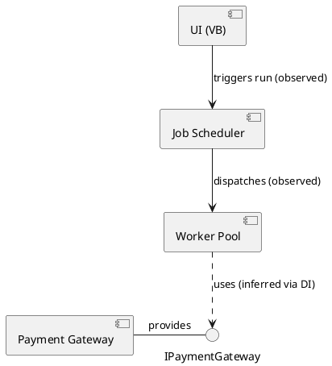
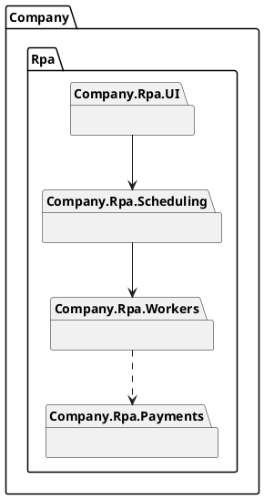

# Development view — PlantUML (component / package)

Serves: "how is the code organized as modules, and which components interact to provide
behavior X?" Derivability: **High** — projects/assemblies/namespaces are visible; but
interface-based and DI wiring between components is often `[inferred]` → dash it.

## Confidence legend
```plantuml
legend right
  --  observed: dependency seen in code/project refs
  ..  inferred: wired at runtime (DI/config) — verify
endlegend
```

## Component diagram — components interacting for a behavior

Use `-->` for observed dependencies, `..>` for runtime/DI-wired (inferred). Provided/
required interfaces (`- IPAY`, `..> IPAY`) show the contract between components.

## Package diagram — namespace/project structure

Altitude lever: collapse classes into their package to raise the view above the hairball.
