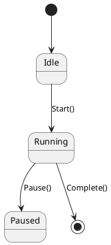

# Logical view — PlantUML (class / object / state)

Serves: "what are the pieces and how do they relate?" Derivability: **High** (but DI,
reflection, events, VB↔C# interop hide/invent edges → dash those).

## Always include the confidence legend
```plantuml
legend right
  <b>Edge confidence</b>
  --  observed: seen directly in code
  ..  inferred: guessed (DI / naming / shape) — verify
endlegend
```

## Class diagram
```plantuml
@startuml
skinparam packageStyle rectangle
package "UI (VB)" { class MainForm }
package "Services (C#)" {
  class OrderService
  interface IPaymentGateway
  class StripeGateway
}
MainForm --> OrderService          : calls (observed)
OrderService ..> IPaymentGateway   : uses (inferred via DI)
StripeGateway ..|> IPaymentGateway : implements
@enduml
```
Arrows: `-->` association/calls · `..>` dependency · `--|>` inheritance ·
`..|>` realization · `*--` composition · `o--` aggregation. Solid = observed, dash = inferred.

## State machine (for a class with meaningful lifecycle)


Altitude: cap ~15 types; hide private members unless asked; multiple focused slices > one hairball.
