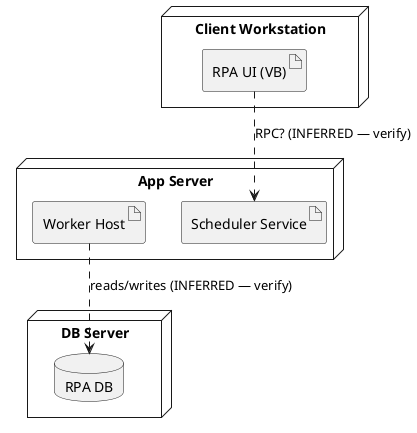
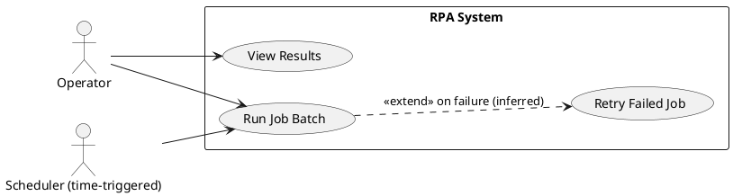

# Physical view & +1 Scenarios — PlantUML (deployment / use case)

Both are **low-derivability from code.** Draw a best-effort draft, label it clearly as
needing human confirmation, and say what you'd need to confirm it.

## Physical (deployment) — topology
Serves: "where does it run?" Source of truth: config, IaC, ops docs, humans — NOT code.

Everything here is inferred unless you read deployment config. State that explicitly.

## +1 Scenarios (use case)
Serves: "what are the key things users do?" Source of truth: requirements/domain, not
code. Propose from observed entry points (UI handlers, endpoints, CLI commands), then
confirm with the people who know.

Use cases derived from code entry points are a starting hypothesis, not the real
requirements — always route them past a domain expert.
