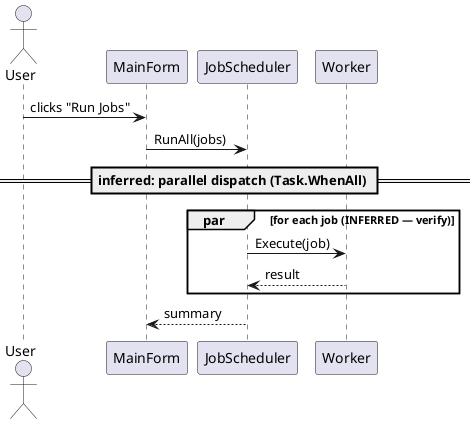
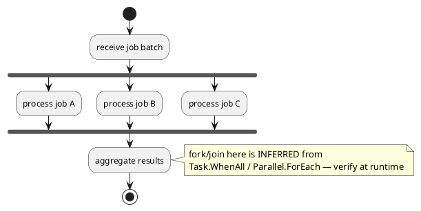
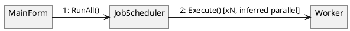

# Process view — PlantUML (sequence / activity / communication)

Serves: "how does it run — control flow, concurrency, timing?" Derivability: **Partial.**
Call *structure* is visible; **actual parallelism/concurrency is runtime — mark it
`[inferred]` and frame as a hypothesis to verify by running/profiling.**

## Confidence legend
```plantuml
legend right
  --  observed: call/flow seen in code
  ..  inferred: concurrency/dispatch not confirmable statically — verify
endlegend
```

## Sequence — trace ONE behavior end to end

`par ... end` shows parallel fragments — label them INFERRED unless you saw the
concurrency construct directly.

## Activity — parallel processing via fork/join

`fork` / `fork again` / `end fork` = concurrent branches. This is the diagram for
"illustrate the parallel processing" — but concurrency is the confabulation zone, so
the note and INFERRED labels are mandatory.

## Communication (collaboration) — who-talks-to-whom for a behavior

